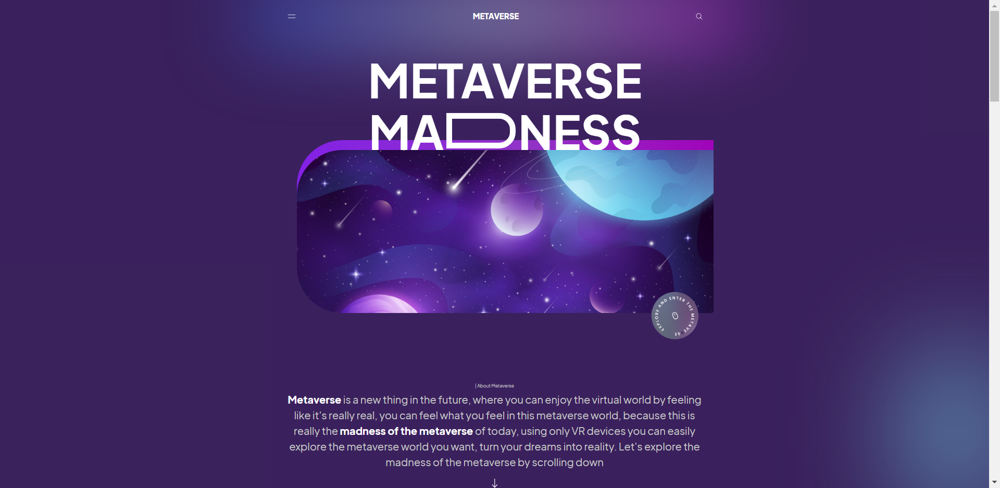

# NextJS 14 full stack landing page with Framer Motion 

- To use app create a **.env** file in root of project folder (e.g. next-full-ts) and create these variables

**JWT_KEY=<YOUR_SECRET_KEY>**
**DB_URI=<DB_CONNECTION_URI>**
**DOMAIN=<YOUR_DOMAIN> or 'http://localhost:3000'**
**NEXT_PUBLIC_APP_NAME='Metaverse'**

 **Screenshots**

 
 

